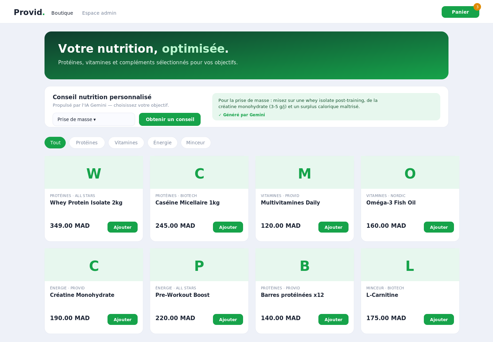
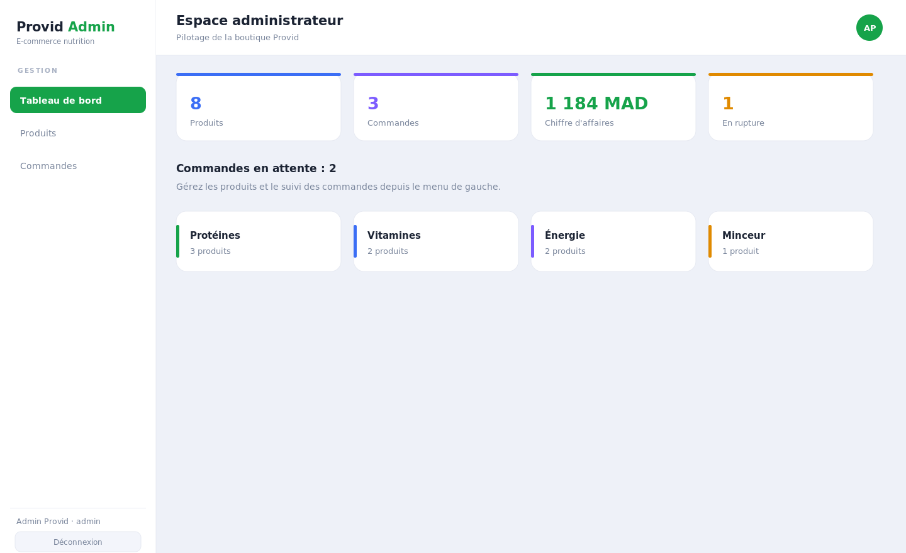
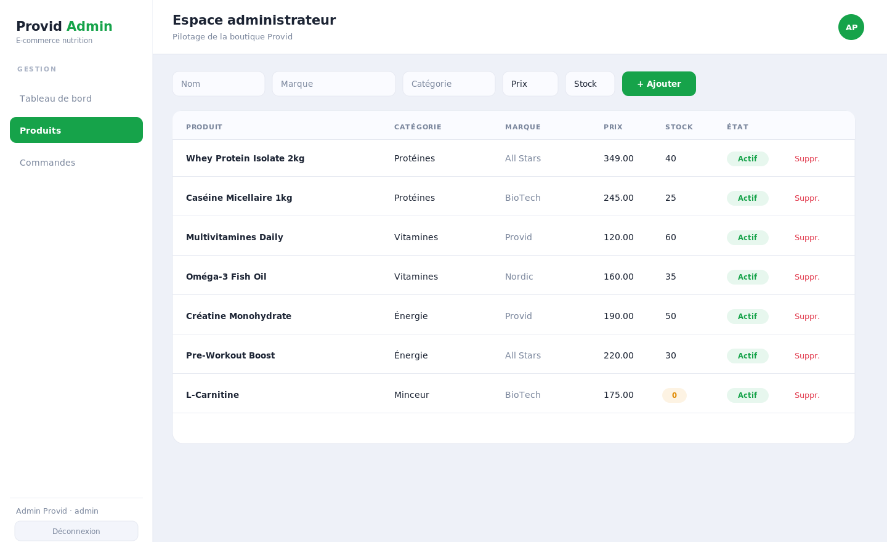
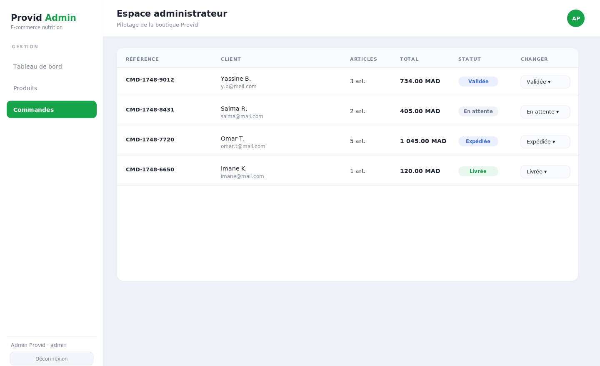

# Provid — Plateforme e-commerce nutrition

Boutique en ligne de compléments alimentaires avec **espace client** (catalogue, panier, commande) et **espace administrateur** (produits, commandes, tableau de bord). Backend **Spring Boot** (Java) + frontend **React (Vite)**.

> Projet personnel de Badr Chigar — Ingénieur d'État en Informatique (EMSI Casablanca), développeur Full Stack Java/Spring & React.

## Captures d'écran

### Boutique (espace client)


### Tableau de bord (espace admin)


### Gestion des produits


### Gestion des commandes


## Fonctionnalités

**Espace client**
- Catalogue de produits filtrable par catégorie (protéines, vitamines, énergie, minceur).
- Panier persistant (localStorage) avec quantités.
- Passage de commande → décrément automatique du stock côté serveur.
- Recommandations nutrition (endpoint prêt pour l'**API Google Gemini**).

**Espace administrateur**
- Authentification (rôle `ADMIN`).
- CRUD complet des produits.
- Suivi des commandes avec workflow de statut (`En attente → Validée → Expédiée → Livrée`).
- Tableau de bord : produits, commandes, chiffre d'affaires, ruptures de stock.

## Stack

| Couche | Technologies |
|--------|--------------|
| Frontend | React 18, Vite, React Router |
| Backend | Spring Boot 2.7, Spring Data JPA, Hibernate |
| Base de données | H2 (démo) / MySQL (production) |
| IA | Google Gemini API (recommandations) |

## Architecture

```
provid/
├── backend/                 API REST Spring Boot
│   └── src/main/java/ma/provid/
│       ├── model/           entités JPA (Produit, Commande, ...)
│       ├── repository/      Spring Data JPA
│       ├── controller/      Produit, Commande, Auth, Stats, Nutrition
│       ├── dto/             objets de transfert
│       └── config/          CORS + jeu de données de démo
└── frontend/                SPA React (Vite)
    └── src/
        ├── pages/           Boutique, Panier, Login, Admin*
        └── components/      ClientLayout, AdminLayout
```

## Démarrage

### Backend (port 8080)
```bash
cd backend
mvn spring-boot:run
```
La base H2 en mémoire est créée et alimentée automatiquement (aucune installation requise).

### Frontend (port 5173)
```bash
cd frontend
npm install
npm run dev
```

### Comptes de démo
| Email | Mot de passe | Rôle |
|-------|--------------|------|
| `admin@provid.ma` | `admin123` | ADMIN |
| `client@provid.ma` | `client123` | CLIENT |

## API (extrait)

| Méthode | Route | Description |
|---------|-------|-------------|
| `GET` | `/api/produits` | Catalogue (produits actifs) |
| `POST` | `/api/commandes` | Passer une commande |
| `POST` | `/api/auth/login` | Authentification |
| `GET` | `/api/admin/produits` | Liste admin |
| `PATCH` | `/api/admin/commandes/{id}/statut` | Changer le statut |
| `GET` | `/api/admin/stats` | KPIs du tableau de bord |
| `POST` | `/api/conseil` | Recommandation nutrition (Gemini) |

## Licence
MIT © Badr Chigar
